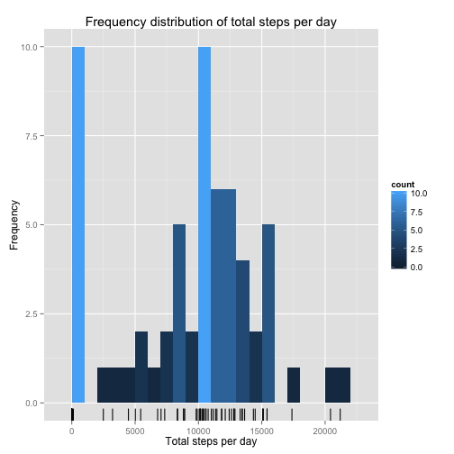
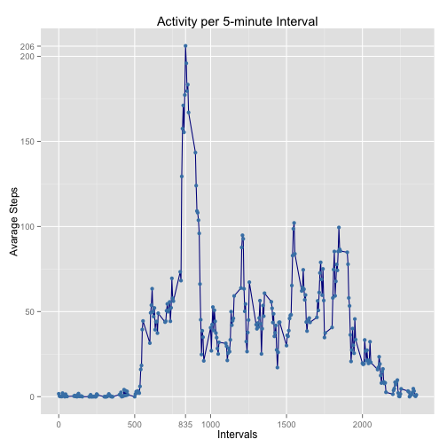
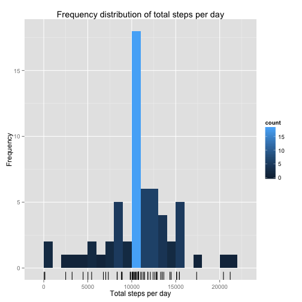
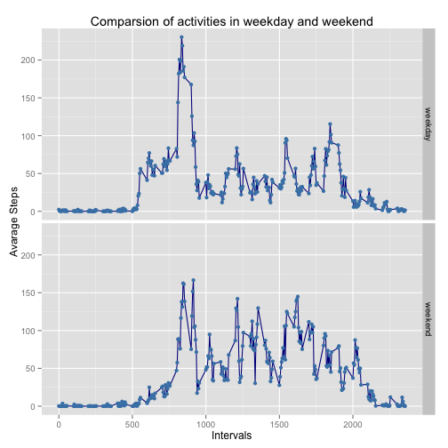

#Reproducible Research: Peer Assessment 1

This Data analysis is created for a peer assessment for  
[Reproductive Reserarch](https://www.coursera.org/course/repdata) course which is module in 
Data Science Specialization by Johns Hopkins University.

Author: Marcin Wiśniowski

Date: 2015-01-14

### Libraries used for assessment

```r
library("data.table")
library("ggplot2")
library("lubridate")
```

## Dataset

The data for this assignment can be downloaded from the course website:
[Activity monitoring data](https://d396qusza40orc.cloudfront.net/repdata%2Fdata%2Factivity.zip) 52K

The variables included in this dataset are:

* **steps**: Number of steps taking in a 5-minute interval (missing values are coded as `NA`)

* **date**: The date on which the measurement was taken in YYYY-MM-DD format

* **interval**: Identifier for the 5-minute interval in which measurement was taken


The dataset is stored in a comma-separated-value (CSV) file and there are a total of 17,568 
observations in this dataset.

## Loading and preprocessing the data
Dataset should be stored in the same directory as processing script file. First step is to check if
Dataset file is available and then uncompress it for future processing.

```r
if( !file.exists("activity.zip") ){
    download.file(
        "https://d396qusza40orc.cloudfront.net/repdata%2Fdata%2Factivity.zip", 
        destfile="activity.zip",
        method="curl"
        )
}
unzip("activity.zip")
```

Unzipped file can be easily read with read.csv function. First step is to transform date coded as
YYYY-MM-DD to the date object within data table.


```r
data <- fread("activity.csv")
data$date <- ymd(data$date)
```

## What is mean total number of steps taken per day?

During this analysis the missing values will be ignored. As a preparation for this task new data
table will be created. This data table will have two columns:

* **date**: The date on which the measurement was taken coded as POSIXct date object

* **steps**: Total number of step that were mesured through day


```r
data.total_steps <- data[,sum(steps, na.rm=TRUE),by=date]
setnames(data.total_steps, c("date", "steps"))
```

This table can be easily visualized as a histogram


```r
plot.total_steps <- ggplot( data.total_steps, aes(x=steps) ) 
plot.total_steps <- plot.total_steps + geom_histogram(binwidth = 1000, aes(fill = ..count..))
plot.total_steps <- plot.total_steps + xlab("Total steps per day") + ylab("Frequency")
plot.total_steps <- plot.total_steps + ggtitle("Frequency distribution of total steps per day")
plot.total_steps <- plot.total_steps + geom_rug(sides="b")
plot.total_steps
```

 

Analyzing the raw numbers, it gives the conclusion of:

* Mean number of steps per day: **9354**

* Median of steps per day: **10395**


```r
summary( data.total_steps )
```

```
##       date                steps      
##  Min.   :2012-10-01   Min.   :    0  
##  1st Qu.:2012-10-16   1st Qu.: 6778  
##  Median :2012-10-31   Median :10395  
##  Mean   :2012-10-31   Mean   : 9354  
##  3rd Qu.:2012-11-15   3rd Qu.:12811  
##  Max.   :2012-11-30   Max.   :21194
```

## What is the average daily activity pattern?

For this analysis new data table, should be created. This table should have definde two columns: 

* **interval**: Identifier for the 5-minute interval in which measurement was taken,
* **mean_steps**: The average number of steps recorded for the interval.


```r
data.avarages <- data[,mean(steps, na.rm=TRUE),by=interval]
setnames(data.avarages, c("interval", "mean_steps"))
```

While looking closer to the avarage values of the steps, the most active intervals can be spoted.


```r
plot.avg_steps <- ggplot(data.avarages, aes(x=interval, y=mean_steps))
plot.avg_steps <- plot.avg_steps + geom_line(colour="darkblue") +  geom_point(colour="steelblue")
plot.avg_steps <- plot.avg_steps + ggtitle("Activity per 5-minute Interval")
plot.avg_steps <- plot.avg_steps + xlab("Intervals") + ylab("Avarage Steps")
plot.avg_steps <- plot.avg_steps + scale_x_continuous(
    breaks=append(seq(0,2500, by=500), 835),
    minor_breaks=seq(0,2500, by=250)
    )
plot.avg_steps <- plot.avg_steps + scale_y_continuous(
    breaks=append(seq(0,250, by=50), 206),
    minor_breaks=seq(0,250, by=25)
    )
plot.avg_steps
```

 

The peak activity of **206.1698** steps in avarage was recorded in 5-minute interval identified as 
**835**. 


```r
maximum_steps <- max(data.avarages$mean_steps)
data.avarages[data.avarages$mean_steps == maximum_steps]
```

```
##    interval mean_steps
## 1:      835   206.1698
```

## Imputing missing values

Provided data set has exacly **2304** rows with missing values


```r
sum(is.na(data$steps))
```

```
## [1] 2304
```
 
The strategy within this analysis has adopted strategy to replace missing values of steps with the 
mean activity for that 5-minute interval. Mean values will be rounded to simulate real observation.

Using this strategy new data table will be created by joining two tables:

* **data**
* **data.avarages**


```r
data.imputed <- merge(data, data.avarages, by="interval")
data.imputed$mean_steps <- round(data.imputed$mean_steps)
data.missing <- is.na(data.imputed$steps)
data.imputed$steps[data.missing] <- data.imputed$mean_steps[data.missing] 
data.imputed[,mean_steps:=NULL]
```

```
##        interval steps       date
##     1:        0     2 2012-10-01
##     2:        0     0 2012-10-02
##     3:        0     0 2012-10-03
##     4:        0    47 2012-10-04
##     5:        0     0 2012-10-05
##    ---                          
## 17564:     2355     0 2012-11-26
## 17565:     2355     0 2012-11-27
## 17566:     2355     0 2012-11-28
## 17567:     2355     0 2012-11-29
## 17568:     2355     1 2012-11-30
```

After replacing missing values of steps with the mean one, check how it influenced on distribution
of daily activities.


```r
data.imputed_total_steps <- data.imputed[,sum(steps, na.rm=TRUE),by=date]
setnames(data.imputed_total_steps, c("date", "steps"))
```

This table can be easily visualized as a histogram


```r
plot.imputed_steps <- ggplot( data.imputed_total_steps, aes(x=steps) ) 
plot.imputed_steps <- plot.imputed_steps + geom_histogram(binwidth = 1000, aes(fill = ..count..))
plot.imputed_steps <- plot.imputed_steps + xlab("Total steps per day") + ylab("Frequency")
plot.imputed_steps <- plot.imputed_steps + ggtitle("Frequency distribution of total steps per day")
plot.imputed_steps <- plot.imputed_steps + geom_rug(sides="b")
plot.imputed_steps
```

 

The effect of imputing a value for all missing observations of steps has increased the value of both
mean and median. What is more mean and median values are now more coincindent. Another effect of 
this action is decreasing weight of 0 values and increasing the domination of avarages.

* Mean number of steps per day: **10762**

* Median of steps per day: **10766**


```r
summary( data.imputed_total_steps )
```

```
##       date                steps      
##  Min.   :2012-10-01   Min.   :   41  
##  1st Qu.:2012-10-16   1st Qu.: 9819  
##  Median :2012-10-31   Median :10762  
##  Mean   :2012-10-31   Mean   :10766  
##  3rd Qu.:2012-11-15   3rd Qu.:12811  
##  Max.   :2012-11-30   Max.   :21194
```

## Are there differences in activity patterns between weekdays and weekends?

To the dataset with the filled-in missing values will be added a column which indicates if it is a
weekday or weekend.


```r
data.imputed[weekdays(date) %in% c("Saturday", "Sunday"), day_type := 'weekend']
```

```
##        interval steps       date day_type
##     1:        0     2 2012-10-01       NA
##     2:        0     0 2012-10-02       NA
##     3:        0     0 2012-10-03       NA
##     4:        0    47 2012-10-04       NA
##     5:        0     0 2012-10-05       NA
##    ---                                   
## 17564:     2355     0 2012-11-26       NA
## 17565:     2355     0 2012-11-27       NA
## 17566:     2355     0 2012-11-28       NA
## 17567:     2355     0 2012-11-29       NA
## 17568:     2355     1 2012-11-30       NA
```

```r
data.imputed[!weekdays(date) %in% c("Saturday", "Sunday"), day_type := 'weekday']
```

```
##        interval steps       date day_type
##     1:        0     2 2012-10-01  weekday
##     2:        0     0 2012-10-02  weekday
##     3:        0     0 2012-10-03  weekday
##     4:        0    47 2012-10-04  weekday
##     5:        0     0 2012-10-05  weekday
##    ---                                   
## 17564:     2355     0 2012-11-26  weekday
## 17565:     2355     0 2012-11-27  weekday
## 17566:     2355     0 2012-11-28  weekday
## 17567:     2355     0 2012-11-29  weekday
## 17568:     2355     1 2012-11-30  weekday
```

To compare the mean steps taken in weekend against working day a proper data table should be created


```r
data.day_type_mean <- data.imputed[,mean(steps), by=c("day_type", "interval")]
setnames(data.day_type_mean, c("day_type", "interval", "avg_steps"))
```

The best method of comparing the activities during working days and weekend is to plot them. 


```r
plot.day_steps <- ggplot(data.day_type_mean, aes(x=interval, y=avg_steps))
plot.day_steps <- plot.day_steps + geom_line(colour="darkblue") + geom_point(colour="steelblue")
plot.day_steps <- plot.day_steps + facet_grid(day_type ~ .)
plot.day_steps <- plot.day_steps + ggtitle("Comparsion of activities in weekday and weekend")
plot.day_steps <- plot.day_steps + xlab("Intervals") + ylab("Avarage Steps")
plot.day_steps
```

 


